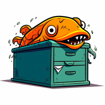

Content Grapher (congr)
=====

Traverse a Windows or Linux directory tree and write directory metadata to a Turtle file. Optionally include file metadata and file fingerprints.

Usage
-----

To use `congr.py`, run it from the command line with your desired options. Here's an example:

- `python congr.py --iri http://myweb.com/files/ --no-fingerprints -o myoutput.ttl`

This will generate an RDF graph of your filestore metadata, excluding file fingerprints, with the IRI for the starting directory node set to 'http://myweb.com/files/'. The output will be written to `myoutput.ttl`.

### Arguments

`congr.py` can be run from the command line using the arguments below. Arguments are case-sensitive. Arguments can be abbreviated to their shortest unique form. For example, `--files` can be abbreviated to `-f`. Arguments can be provided in any order. Default values may between releases, so it's best to specify all arguments explicitly.

- `starting_dir_path`: Path to the starting directory (default: 'C:/Users/StevenChalem/congr-test').

- `--iri`: IRI for the starting directory node (default: 'http://example.com/files/').

- `--files`: Include files in metadata (default). **Including files can result in a very large output file.**

- `--no-files`: Exclude files from metadata. **If you only need a directory tree, choose this.**

- `--fingerprints`: Create file fingerprints (default). **Fingerprinting is slow, especially over slow network connections. It requires reading the entire file into memory.**

- `--no-fingerprints`: Exclude file fingerprints. **If you don't need fingerprints, choose this for better performance.**

- `-o, --output`: Output file name (default: 'output/congr-output.ttl').

Usage Examples
-----

In this example, the `&` in the directory name was causing problems so we ran congr.py from the directory.

**`PS C:\Users\StevenChalem\semantic arts\SA Staff - Documents\Clients & Partners>`**

- `python "C:/Users/StevenChalem/git/congr/congr.py" . -o "C:/Users/StevenChalem/congr-test/output1.ttl" --files --no-fingerprints`

Another example run from inside the target directory:

`PS C:\users\stevenchalem\semantic arts\SA Staff - Documents> 
python "C:/Users/StevenChalem/git/congr/congr.py" . -o "C:/Users/StevenChalem/congr-test/output1.ttl" --files --no-fingerprint --iri https://data.semanticarts.com/congr/sa-staff-documents/`

Requirements
-----

(*Italicized items have been coded.*)

**On 2023-06-27, Dave wrote:**

I want to start with the one drive clients subfolder, then move to the internal (not very) shared drive and get a lot of historical clients, and then start into the marketing, which will be proposals as well as client names from Pipedrive.

**On 2023-06-21, Dave wrote:**

The task is to turn our content into triples and integrate it with our structured data.  

At first that sounds overwhelming, but we will bit the elephant a few chunks at a time. 

*First chunk, be able to read a directory and get all the file names, types, dates and sizes. The directory itself will be important later, as we discovered at Morgan, where a document is, is often a good clue as to what it is.*

*So first chunk, write a program (I’m going to suggest python, because chunks 6-10 involve some light weight NLP which will be far easier to do in python, also chunks n-m may involve LLMs or big data or voodoo witchcraft all of which are easier in python).*

*The program should read a directory, and create an instance of gist:Content for each item it finds, and then a triple for the file name, the directory its in, and all the bits of meta data.  We should be able to load it to a Triple store and query it.*

The next several chunks can be done in almost any order, but to give you a hint as to where we are going:

- *Get a fingerprint of the file (so we can detect how many duplicate copies we have)*
- *Recursively do the directory tree, and attach directories to directories*

- Do some simplistic entity resolution for clients and prospects.  This will require some negotiation with Jamie as to how we are going to entity resolve clients and prospects in new SA
- Get some meta data from the files, especially author, but see what else might be interesting.  Usually the tags are worthless and the program used not interesting.  Maybe the original creation date.
- Read some documents with NLP and start experimenting with extracting useful key words.  These will typically be unusual words in English lanaguage and named entities and the like.  This will take an entire career, but just get a start

The objective is to be able to be in new SA system and click on a project and get all the important documents related to that project, or click on a person and get all the documents that person authored, or all the documents that person was named in.  

PS we have about 500K files on the shared folder.  Most are worth indexing.  Some need to be purged as being early drafts on old projects.  Some are sensitive (employee evals and the like)
